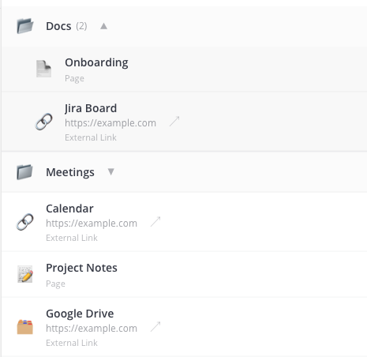
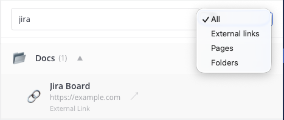
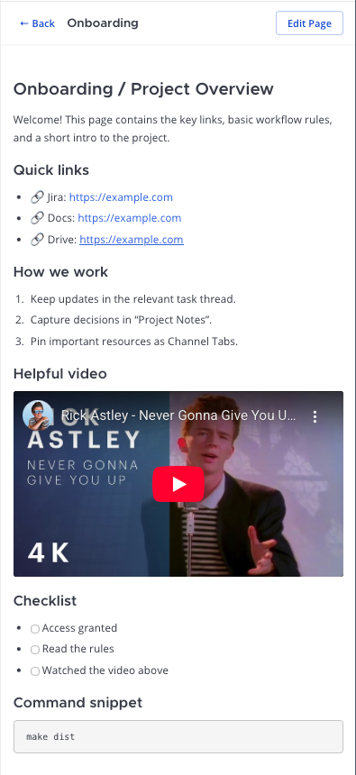
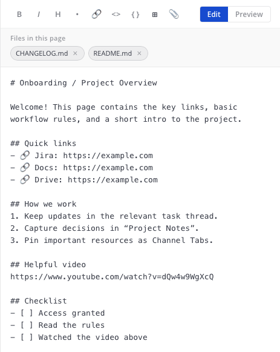

# Channel Tabs — Mattermost Plugin

Add customizable tabs to Mattermost channels: external links, embedded Markdown pages, and folders for organizing documentation, rules, and knowledge bases.

## Features

- **Link tabs** — pin external URLs to a channel for quick access
- **Page tabs** — create rich Markdown pages directly inside a channel (backed by real Mattermost posts for full mobile compatibility)
- **YouTube embeds in pages** — paste YouTube links and they render as embedded videos
- **File upload in page editor** — upload files while editing a page and auto-insert Markdown links/images at cursor position
- **Folders** — group related tabs into collapsible folders (one level of nesting)
- **Drag & drop** — reorder tabs and move them between folders
- **Search & filter** — quickly find tabs by title/URL/page content, and filter by type
- **Custom icons** — assign emoji icons to any tab
- **Channel header sync** — optionally mirror tabs as Markdown links in the channel header so mobile clients can see them
- **Fallback post** — when the header overflows, a bot post with the full navigation is auto-maintained and linked from the header
- **Localization** — English and Ukrainian UI

## Screenshots

<table>
  <tr>
    <td align="center" width="50%">
      <strong>RHS: Tabs overview</strong><br/>
      
    </td>
    <td align="center" width="50%">
      <strong>Search & filter</strong><br/>
      
    </td>
  </tr>
  <tr>
    <td align="center" width="50%">
      <strong>Page viewer (YouTube embed)</strong><br/>
      
    </td>
    <td align="center" width="50%">
      <strong>Page editor (file upload + linked files)</strong><br/>
      
    </td>
  </tr>
</table>

## Requirements

- Mattermost Server **7.0+**
- Plugin uploads enabled in System Console (`PluginSettings.EnableUploads = true`)

## Installation

1. Download the latest release `.tar.gz` from the [Releases](../../releases) page (or build from source — see below).
2. In Mattermost, go to **System Console → Plugins → Plugin Management**.
3. Upload the `.tar.gz` file and click **Enable**.

## Configuration

| Setting | Default | Description |
|---------|---------|-------------|
| **Maximum Tabs Per Channel** | 30 | Limit of tabs allowed per channel (1–50). |
| **Duplicate Tabs in Channel (Bot Posts)** | false | When enabled, the plugin creates/updates bot posts in the channel for Page tabs (and the navigation fallback post). |
| **Header Display Mode** | none | Choose how channel tabs appear in the channel header (none/hint/full). Full requires bot posts. |

## Usage

1. Open any channel and click the **Channel Tabs** button in the channel header.
2. The Right-Hand Sidebar panel opens with the tab list.
3. Click **+ Add Tab** to create a link, page, or folder.
4. Only channel/team/system admins can manage tabs; all members can view them.

### Page file uploads

- Open a **Page** tab and click **Edit Page**
- Use the **📎** button in the editor toolbar to upload a file
- The plugin inserts a Markdown reference automatically:
  - image files as ``
  - other files as `[name](...)`

## Building from Source

Prerequisites: **Go 1.21+**, **Node.js 18+**, **npm 9+**.

```bash
# Clone the repo
git clone https://github.com/<your-org>/mattermost-plugin-channel-tabs.git
cd mattermost-plugin-channel-tabs

# Build the distributable
make dist
```

The resulting `.tar.gz` will be in the `dist/` directory.

## Development

```bash
# Watch mode (auto-deploys to a local Mattermost instance with Local Mode enabled)
make watch
```

## License

This project is licensed under the Apache 2.0 License — see the [LICENSE](LICENSE) file for details.
